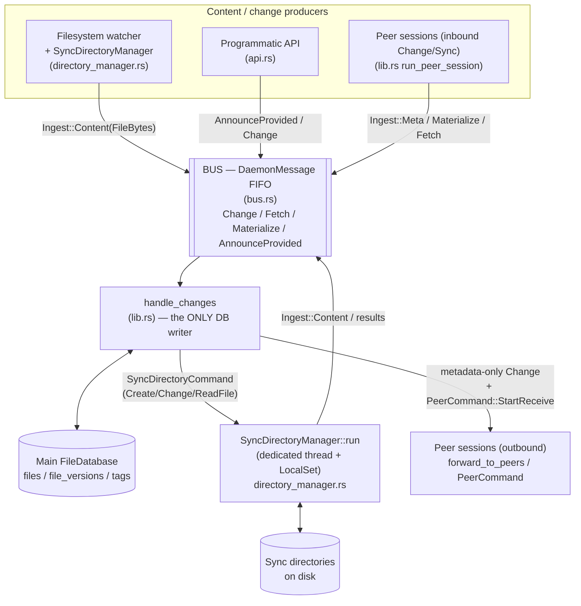
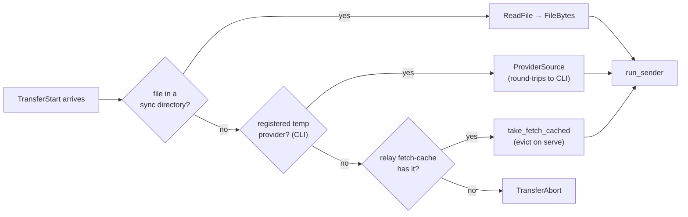
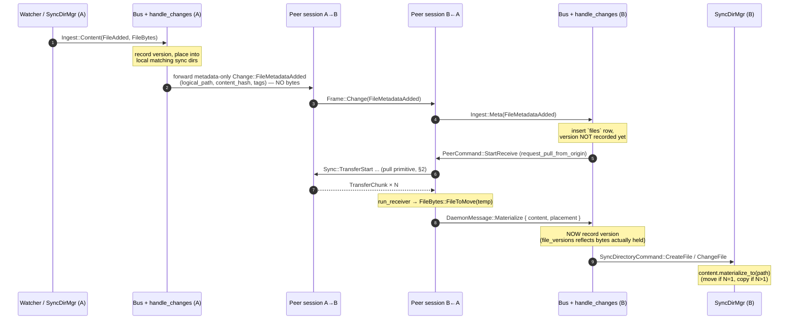
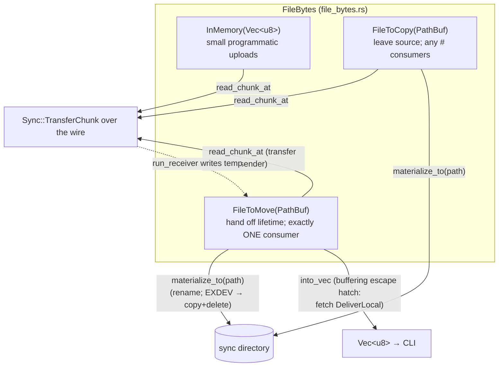

# tagnet data flow (post streaming-refactor)

This document diagrams how data moves through the system after the file-content
streaming refactor (`c008989` … `5595c77`). The central shift:

- File **content** is no longer a fully-buffered `Vec<u8>` at every hop. Internally
  it is a [`FileBytes`](tagnetd/src/file_bytes.rs) (`InMemory` / `FileToCopy` /
  `FileToMove`) that may still live on disk.
- `Change::FileMetadataAdded` / `Change::FileMetadataChanged` are
  **metadata-only** on the wire.
- Bytes move over a separate **pull-based transfer** primitive
  (`Sync::Transfer{Start,ChunkRequest,Chunk,Abort}`), driven by the *receiver*.
- Reconciliation, live peer changes, on-demand fetch (`tagnet edit`), and CLI
  uploads all deliver bytes through that one transfer primitive. The CLI serves
  its own uploads as a temporary **chunk provider** over the control socket.

---

## 1. Component wiring (one daemon)



Key point: **`handle_changes` is the single serialization point / sole DB
writer.** Everything funnels through the ordered `DaemonMessage` bus so message
ordering per producer is preserved (bus.rs).

---

## 2. The pull-based transfer primitive (receiver-driven)

Every byte movement between two daemons uses this one primitive. The **receiver
drives**; the sender only ever replies. This gives backpressure and fair
interleaving for free.

```mermaid
sequenceDiagram
    autonumber
    participant R as Receiver daemon<br/>(run_receiver, transfer.rs)
    participant S as Sender daemon<br/>(run_sender, transfer.rs)

    Note over R,S: correlated by a fresh TransferId; demuxed per-session<br/>transfers: HashMap&lt;TransferId, Sender&lt;TransferMessage&gt;&gt;

    R->>S: Sync::TransferStart { transfer_id, file_id, content_hash }
    Note over S: resolve source (priority):<br/>1. sync-dir file (ReadFile)<br/>2. temp provider (CLI upload)<br/>3. relay fetch-cache
    loop window of WINDOW=8 requests in flight
        R->>S: Sync::TransferChunkRequest { offset }
        S-->>R: Sync::TransferChunk { offset, bytes(64KiB), last }
    end
    Note over R: stream to temp file,<br/>incremental BLAKE3
    Note over R: on `last`: verify hash == content_hash<br/>match → FileBytes::FileToMove(temp)<br/>mismatch → Abort (never commit)
    R--xS: Sync::TransferAbort { reason }  (either side, on error)
```

Source resolution on the sender side (`TransferStart`, lib.rs:1319-1357):



---

## 3. Live change: local edit → peer receives bytes

A file changes locally. Peers get a **metadata-only** announcement, then **pull**
the bytes.



If the announcing peer is **not** live when the metadata arrives, the pull is
deferred to reconciliation on reconnect (lib.rs:1741).

---

## 4. Connect-time reconciliation

On connect (after the signed public-key handshake) both sides send their
`Manifest` and `TagManifest` unprompted, then pull whatever they're missing.

```mermaid
sequenceDiagram
    autonumber
    participant A as Daemon A
    participant B as Daemon B

    Note over A,B: TCP → WS upgrade → signed public-key handshake
    A->>B: Sync::Manifest { entries: [ManifestEntry{file_id, history, latest_observed_at}] }
    A->>B: Sync::TagManifest { definitions, relationships }
    B->>A: Sync::Manifest / Sync::TagManifest (symmetric)

    Note over B: reconcile_peer_manifest → decide_request per file:<br/>unknown | equal | behind (want) | divergent (LWW by latest_observed_at)
    loop each wanted, locally-known file
        B->>A: Sync::TransferStart (pull primitive, §2)
        A-->>B: TransferChunk × N → Materialize
    end
    Note over B: tags: definitions pulled via TagRequest→TagAdded;<br/>relationships applied directly by last-writer-wins
```

> Known gap (see `STREAMING_FOLLOWUPS.md` §1.4): `ManifestEntry` carries no
> logical path, so a file the receiver has **never seen** is skipped at
> reconnect — files created while both peers were offline don't sync until a
> live `FileMetadataAdded` (which does carry the path) is seen.

---

## 5. On-demand fetch (`tagnet edit`) — flood + store-and-forward

When a device wants bytes it doesn't hold, it floods a `FetchRequest` across the
(assumed-acyclic) tree of live connections. The first `FetchFound` unwinds back,
and bytes are pulled hop-by-hop via the same transfer primitive.

```mermaid
sequenceDiagram
    autonumber
    participant O as Origin A (has metadata, no bytes)
    participant B as Relay B
    participant C as Holder C (has bytes)

    O->>B: Sync::FetchRequest { request_id, file_id, expected_hash }
    B->>C: FetchRequest (forward to all peers except sender)
    Note over C: local_hash_matches → yes
    C-->>B: Sync::FetchFound { request_id, content_hash }  (content-LESS)
    Note over B: first-wins; open receiver toward C
    B->>C: TransferStart (pull §2)
    C-->>B: TransferChunk × N
    Note over B: cache_relay_file (store-and-forward),<br/>then unwind FetchFound upward
    B-->>O: Sync::FetchFound (content-less)
    O->>B: TransferStart (pull §2)
    B-->>O: TransferChunk × N  (served from fetch-cache, evict-on-serve)
    Note over O: into_vec → deliver to CLI
```

- `FetchMissing` unwinds when a subtree is exhausted; `HOP_TIMEOUT=8s` forces
  resolution of the flooding phase (fetch.rs).
- Per-hop in-flight bytes are bounded to `WINDOW * CHUNK_SIZE`.

---

## 6. CLI upload/edit — the CLI as a temporary chunk provider

`tagnet u <file>` never pushes the whole file across the control socket. It sends
**metadata only**, registers itself as a provider, and serves chunks on demand
(reverse-direction pull over the control socket). It blocks until a storing peer
has pulled the file (`ProviderReleased`).

```mermaid
sequenceDiagram
    autonumber
    participant CLI as tagnet CLI<br/>(main.rs / control.rs)
    participant D as Daemon (control.rs)
    participant Peer as Storing peer

    Note over CLI: stream-hash file (BLAKE3, 64KiB), never fully buffered
    CLI->>D: ControlRequest::UploadFile { path_name, content_hash, tags }
    Note over D: api.upload_file → AnnounceProvided (metadata-only FileMetadataAdded)<br/>register_provider(file_id, ProviderSource)
    D-->>Peer: Change::FileMetadataAdded (metadata-only, forwarded to peers)
    Note over CLI: block in wait_for_release(file_id)

    Peer->>D: Sync::TransferStart (peer pulls, §2)
    loop each chunk the peer requests
        D->>CLI: ControlFrame::ProviderChunkRequest { chunk_id, offset }
        CLI-->>D: ControlFrame::ProviderChunkReply { chunk_id, bytes, last }
        D-->>Peer: Sync::TransferChunk
    end
    Note over D: on last chunk: ProviderSource.on_complete →<br/>unregister_provider
    D->>CLI: ControlFrame::Event(ApiEvent::ProviderReleased { file_id })
    Note over CLI: unblocks; deletes local source unless --keep
```

`tagnet edit` on a **non-local** file: fetch bytes (§5, returned whole as
`ControlResponse::FileContent`), edit in `$EDITOR`, then write back via the
**same** provider path as upload (`EditFile`). On a **local** file it just opens
the real file in place and lets the watcher propagate the save.

---

## 7. `FileBytes` — content-in-transit, daemon-only

Never serialized. Describes *where* content lives and *how* a consumer may take
it, so large files need not be buffered.



- `materialize_to`: move when a single sync dir wants the file (zero extra
  copies), copy when several do (then remove the source).
- `into_vec`: the one place bytes are fully buffered again — delivering a fetched
  file to the CLI.

---

## Legend / cross-references

| Concept | Where |
|---|---|
| Wire protocol (`Change`, `Sync`, `ManifestEntry`, `Frame`) | `tagnet-core/src/lib.rs` |
| Bus / `DaemonMessage` / `PeerCommand` | `tagnetd/src/bus.rs` |
| `handle_changes`, peer sessions, reconciliation, pull wiring | `tagnetd/src/lib.rs` |
| Pull transfer primitive (`run_receiver`/`run_sender`) | `tagnetd/src/transfer.rs` |
| On-demand fetch flood/unwind + relay cache | `tagnetd/src/fetch.rs` |
| Sync directory materialization | `tagnetd/src/directory_manager.rs` |
| `FileBytes` content-in-transit | `tagnetd/src/file_bytes.rs` |
| Control socket (`ControlFrame`, provider protocol) | `tagnetd/src/control.rs` |
| CLI commands (`u`, `edit`, `download`) | `tagnet/src/main.rs` |

Open correctness gaps and cleanups for this refactor are tracked in
[`STREAMING_FOLLOWUPS.md`](STREAMING_FOLLOWUPS.md).
